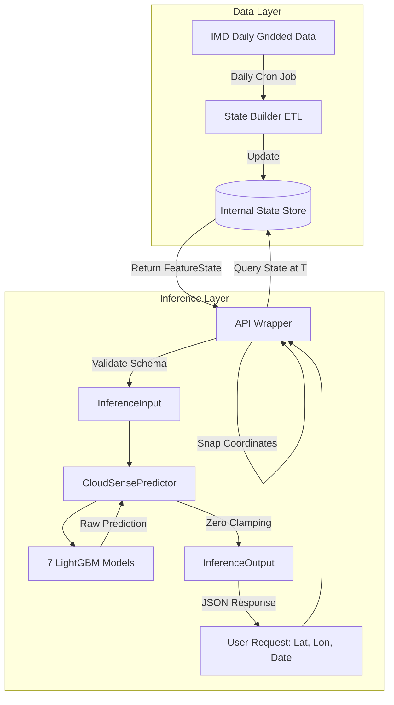

# Phase 8.1: Real-Time Data Architecture & Feature Provenance

## 1. Feature Provenance Table
To bridge the gap between user requests and the frozen Phase 8.0 local inference engine, we must define the exact derivation of the 12-feature contract. 

In this nomenclature, **`T`** represents the base day for which we have complete historical observations. The model predicts for `T+1` (H1), `T+2` (H2), etc.

| Feature Name | Exact Definition (from Pipeline) | Resolution | Lookback Required |
|--------------|----------------------------------|------------|-------------------|
| `rf_lag_1` | Rainfall at the target grid cell on day `T`. | 0.25° | None (Day T only) |
| `rf_lag_2` | Rainfall at the target grid cell on day `T-1`. | 0.25° | 1 day |
| `rf_roll7_sum` | Sum of rainfall at target grid cell over days `T-6` through `T`. | 0.25° | 7 days |
| `days_since_rain` | Count of consecutive preceding valid observations through `T` where rainfall $\le 0.1$mm. Resets to 0 if $> 0.1$mm. | 0.25° | Indefinite (Until last rain event) |
| `neighbor_mean_lag1` | Mean rainfall of the 8 adjacent neighboring cells on day `T`. | 0.25° | None (Spatial only) |
| `neighbor_max_lag1` | Maximum rainfall of the 8 adjacent neighboring cells on day `T`. | 0.25° | None (Spatial only) |
| `tmax_1deg_lag1` | Maximum temperature at the mapped grid cell on day `T`. | 1.0° | None (Day T only) |
| `tmin_1deg_lag1` | Minimum temperature at the mapped grid cell on day `T`. | 1.0° | None (Day T only) |
| `tmax_1deg_roll7` | Average of maximum temperature at the mapped grid cell over days `T-6` through `T`. | 1.0° | 7 days |
| `diurnal_range_1deg` | `tmax_1deg_lag1` minus `tmin_1deg_lag1`. | 1.0° | None (Day T only) |
| `sin_doy` | $\sin(2\pi \cdot \text{DOY} / 365.25)$ where DOY is the day of year for day `T`. | N/A | None |
| `cos_doy` | $\cos(2\pi \cdot \text{DOY} / 365.25)$ where DOY is the day of year for day `T`. | N/A | None |

---

## 2. Data Provider Analysis & Distribution Shift Risks
The models were trained on data with a 0.25° rainfall grid and a 1.0° temperature grid. These resolutions and bounding boxes perfectly match the **India Meteorological Department (IMD) gridded datasets**.

**Candidate 1: Commercial/Free Weather APIs (e.g., Open-Meteo, OpenWeatherMap, WeatherAPI)**
- *Pros*: Easy to query, instant JSON responses, high availability, free tiers.
- *Cons*: They use model-based reanalysis data (like ECMWF ERA5, NOAA GFS) which differs significantly from gauge-based IMD data. Their definitions of a "daily" accumulation (usually 00:00 to 23:59 UTC/Local) differ from IMD's standard (08:30 IST to 08:30 IST).
- *Risk*: **Extreme Distribution Shift**. Injecting ERA5-based API data into a model trained on IMD gauge data will result in statistically invalid predictions, especially for extreme thresholds.

**Candidate 2: Direct IMD Gridded Data Sync (Recommended)**
- *Pros*: Zero distribution shift. Guaranteed geographic alignment (0.25° and 1.0° grids).
- *Cons*: IMD data is usually published as daily files (NetCDF or GRD) on a delay, requiring a daily background ETL pipeline rather than on-demand API lookups.

---

## 3. Historical Rainfall Strategy
Because `days_since_rain` requires an indefinite lookback period (potentially months in the dry season) and `neighbor_mean_lag1` requires surrounding spatial state, **an on-the-fly external API lookup for a single prediction request is architecturally unviable**. 

CloudSense must maintain its own **Internal State Store** (e.g., PostgreSQL, Redis, or local Parquet). A daily CRON job must fetch the latest IMD observations, compute the rolling metrics and spatial neighbors, and update the state store. The inference API will then simply read the pre-computed 12 features from this store.

---

## 4. Temperature Strategy
The frozen `temperature_features.py` pipeline utilizes `xarray.interp(method='nearest')` to map the 1.0° temperature grid to the 0.25° rainfall grid. The production system must replicate this exactly:
1. Locate the `(lat, lon)` of the requested 0.25° rainfall cell.
2. Find the mathematically nearest center-point in the 1.0° temperature grid.
3. Extract `tmax` and `tmin` from that 1.0° cell.

---

## 5. Spatial Mapping Strategy
When a user provides an arbitrary `(lat, lon)`:
1. Validate it falls within the Indian landmass bounding box defined by the training set.
2. Snap (round) the coordinate to the nearest 0.25° grid center (e.g., rounding to nearest `0.25` offset).
3. If the snapped cell is masked as ocean or outside the dataset boundaries, the system must FAIL explicitly.

---

## 6. Freshness Requirements
Prediction for $T+1$ through $T+7$ requires the complete observation for day $T$. Because daily rainfall observations are accumulated over 24 hours, "Current State" actually means "Yesterday's completed 24-hour observation". Attempting to predict using an incomplete current day (e.g., predicting at noon using 12 hours of rain) violates the temporal contract.

---

## 7. API Credential Requirements
If utilizing IMD open data (FTP/HTTP scraping), **NO API KEY** is formally required, though rate limits and IP restrictions apply. If a commercial provider is eventually forced upon the system (despite distribution risks), standard API keys will be needed. *No credentials will be stored in this codebase yet.*

---

## 8. Cold-Start and Data Failure Behavior
- **Cold Start (New location / missing history)**: If a requested grid cell lacks the requisite 7-day rolling history or `days_since_rain` counter, the API must **FAIL WITH REASON**.
- **Data Failure (Missing variables)**: Do not use `0.0` or mean imputation. If temperature or rainfall is missing for day $T$, prediction cannot proceed.
- **Silent Imputation**: Strictly prohibited.

---

## 9. Production FeatureState Contract
The intermediate object passed between the internal state store and the Phase 8.0 `CloudSensePredictor`:

```json
{
  "latitude_snapped": 19.25,
  "longitude_snapped": 72.75,
  "base_date_T": "2023-08-15",
  "features": {
    "rf_lag_1": 12.5,
    "rf_lag_2": 0.0,
    ...
  }
}
```

---

## 10. Architecture Diagram



---

## 11. Final Decision

A. **REQUIRED DATA SOURCES**: Daily Gridded Rainfall (0.25°) and Daily Gridded Temperature (1.0°).
B. **RECOMMENDED PRIMARY PROVIDER**: India Meteorological Department (IMD) Gridded Data.
C. **RECOMMENDED FALLBACK PROVIDER**: Copernicus ERA5-Land (Accepting severe distribution shift requiring model recalibration).
D. **API KEY REQUIRED**: NO (Assuming IMD public data parsing).
E. **HISTORICAL RAINFALL SOLUTION**: Internal State Store (DB/Parquet) updated daily.
F. **TEMPERATURE SOLUTION**: Nearest-neighbor lookup from 1.0° grid to 0.25° grid.
G. **SPATIAL MAPPING SOLUTION**: Mathematical rounding to the nearest 0.25° center. Fail on ocean/out-of-bounds.
H. **COLD-START STRATEGY**: Fail explicitly. No silent imputation.
I. **PRODUCTION FEATURE STATE**: A rigid 12-feature JSON object.

### Can CloudSense currently construct the exact 12-feature state required by the frozen models from a real user's latitude/longitude/date?

**NO**

**Explanation**: 
The models require features like `neighbor_mean_lag1` (spatial context) and `days_since_rain` (indefinite historical context). A user merely providing a latitude and longitude does not inherently provide this data, and an external API cannot dynamically return 8 spatial neighbors and indefinite temporal history fast enough for a real-time prediction request. 

We are missing the **Internal State Store (ETL Pipeline)**. We must build a system that actively tracks and caches this 12-feature state for all valid grid cells every day, so that the inference API can simply perform a fast database lookup.
